# 家計簿管理Webアプリ

<p align="center">
  <a href="docs/image/Top.png">
    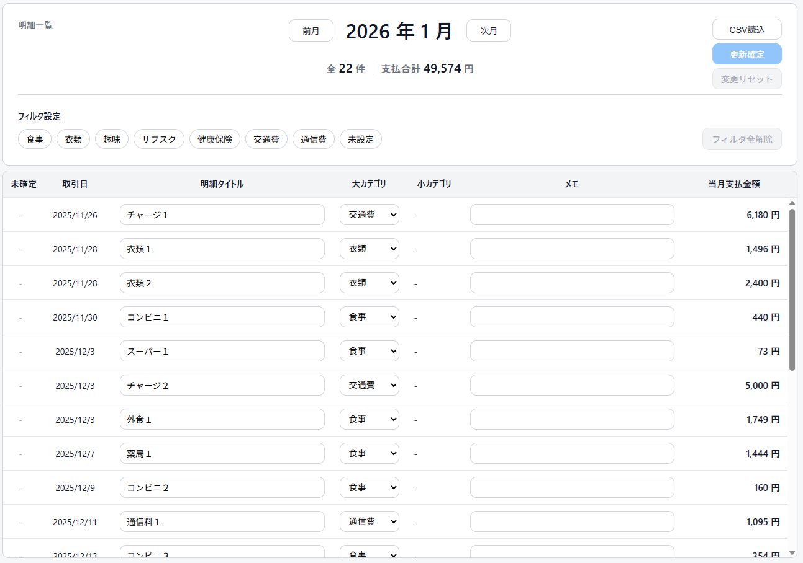
  </a>
</p>

## 概要

　毎月の家計簿入力を簡易化し、好みのカテゴリを付与できるように、楽天カード明細（CSV）を自動で取り込み、可視化するアプリを開発しました。

---

## 背景

- 以前使用していた家計簿アプリがサブスクなしだとほとんど使い物にならない状態になっていた
- 明細に付与するカテゴリをもっと自分仕様にしたい
- システム開発から年単位で離れていたため、手順・技術を確認したい
- フロントエンドに触れたことがなかったので、簡単なシステムでフレームワーク（React）を使用してみたい
- 生成AIが発展したため、学習・設計・実装・レビュー・テストなどで使ってみたい

---

## 使用技術

### フロントエンド

- React 19 / React DOM
- React Router
- React Toastify
- TypeScript 5.9
- Vite 7

### バックエンド

- Java 25(LTS)
- Spring Boot 3.5
- Spring Web / Spring Data JPA / Validation / Actuator
- Docker
- PostgreSQL
- Flyway
- OpenAPI (springdoc)
- Logstash Logback Encoder（構造化ログ）
- ULID 生成ライブラリ

### システム構成

```
[React + Vite] -> [Spring Boot REST API /api/v1] -> [PostgreSQL]
```

- API ベースパスは `/api/v1` を採用
- DB は PostgreSQL 16 を docker-compose で起動できる構成
- DB スキーマは Flyway のマイグレーションで管理

---

### 実装機能

#### API

- 明細一覧取得（GET /api/v1/items）
- 明細更新（POST /api/v1/items/update）
- 明細 CSV 取込（POST /api/v1/items/import/csv）
- 明細カテゴリ取得（GET /api/v1/categories）
- メンバー作成（POST /api/v1/members/create）

#### 画面

**明細一覧の表示**

1. **年月 / 年月の前後移動 / 明細件数 / 合計金額**
    <p>
      <a href="docs/image/Title.png">
        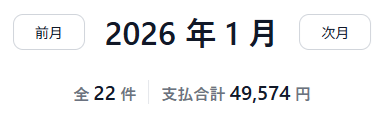
      </a>
    </p></br>

2. **カテゴリフィルタ / フィルタ全解除ボタン**
    <p>
      <a href="docs/image/Filter.png">
        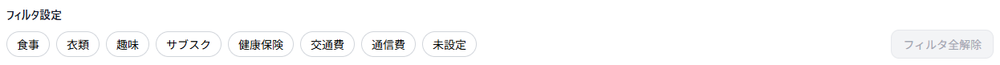
      </a>
    </p></br>

3. **インライン編集（タイトル・カテゴリ・メモ） / 未確定変更の可視化**
    <p>
      <a href="docs/image/BillingTable.png">
        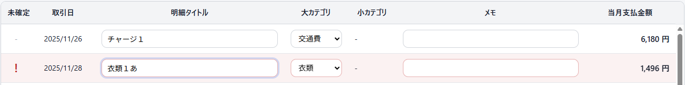
      </a>
    </p></br>

4. **CSV取込ボタン / 更新確定ボタン / 変更リセットボタン**
    | 初期 | 更新確定前 | 編集エラーがある場合 |
    | :---: | :---: | :---: |
    | <a href="docs/image/Button.png">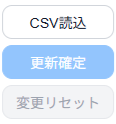</a> | <a href="docs/image/ButtonUpdatePre.png">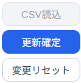</a> | <a href="docs/image/ButtonUpdateError.png">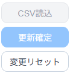</a> |
    | CSV読込：活性</br>更新確定：非活性</br>変更リセット：非活性 | CSV読込：非活性</br>更新確定：活性</br>変更リセット：活性 | CSV読込：非活性</br>更新確定：非活性</br>変更リセット：活性 |
    
    </br>

5. **編集エラー表示**
    <p>
      <a href="docs/image/UpdateError.png">
        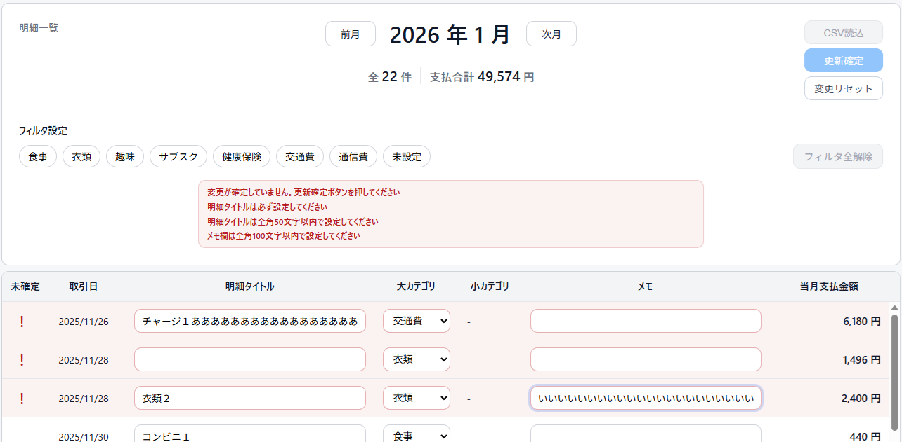
      </a>
    </p>

    エラー内容
    1. 更新未確定のとき
    2. 明細タイトルが空欄のとき（スペースも含む）
    3. 明細タイトルが50文字以上のとき
    4. メモが100文字以上のとき

    </br>

6. **明細更新モーダル**
    <p>
      <a href="docs/image/UpdateModal.png">
        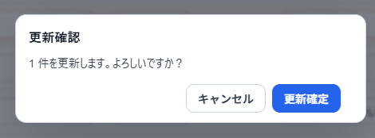
      </a>
    </p></br>

    **更新結果の通知（右上トースト）**
    <p>
      <a href="docs/image/Toast.png">
        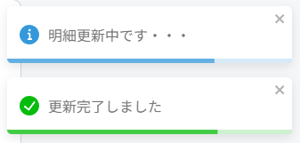
      </a>
    </p></br>

7. **CSV 取込mモーダル**
    <p>
      <a href="docs/image/CSVModal.png">
        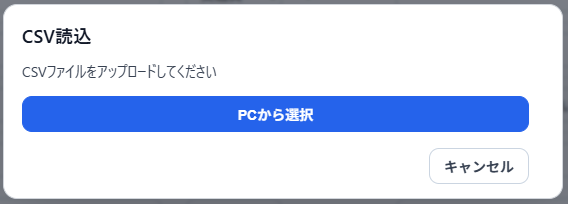
      </a>
    </p></br>

    **読込結果の表示（成功）**
    <p>
      <a href="docs/image/CSVModalSuccess.png">
        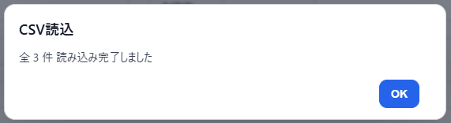
      </a>
    </p></br>

    **読込結果の表示（エラー）**
    <p>
      <a href="docs/image/CSVModalError.png">
        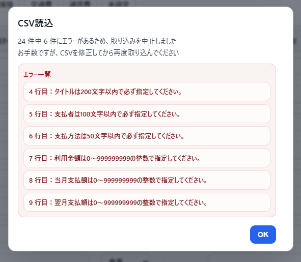
      </a>
    </p>

---

### 工夫している点

- **システム開発手順の確認と最新技術の活用**
  - 要件定義書～詳細設計書を作成し開発方針を事前に決定
  - 生成AI（Codex）を用いたコードレビューの実施
- **環境構築の簡略化**
  - DBはDockerとFlywayを用いて環境構築を簡略化
- **実務を意識したバックエンド開発**
  - Trace ID / Request ID を自動発行し、ログとレスポンスヘッダに埋め込む設計
  - 例外を一元的にハンドリングし、固定形式（timestamp/traceId/errorCode/message など）で返却
  - CSV取込のサイズ上限・拡張子・バイナリ検知・ヘッダー検証・行単位のバリデーションを実装
  - 楽天カードCSVは外貨レート情報が関連する明細の場合、レート情報が別の行に分かれるため、そちらは該当明細データのメモ欄へ自動的に記載
  - リクエストDTOで行うアノテーションによるバリデーションチェックでエラーが起きた場合、カテゴリの各パラメータごとに別々のエラーコードとメッセージを返却
  - 金額整合性や一意制約などを DB 制約でも保証
- **UI の編集差分可視化 + 入力チェック**
  - 更新対象行をハイライトし、入力エラーを画面内で検知
  - ヘッダーのスクロール固定
  - ボタン活性/非活性の明瞭化
    - ボタンが機能が必要のない時、もしくは押されてほしくない時は非活性で防御
  - 未確定の更新をリセットするボタンの実装

---

### 今後の展望

- **テスト実施**
  - 省略した単体テスト・サーバ結合テストの実装。
- **認証・ユーザー単位データ分離**
  - 現状は固定会員 ID の運用のため、認証導入と連動したデータ分離が必要。
- **カテゴリ階層の拡張**
  - 小カテゴリ領域の実装や、カテゴリ管理機能を追加して個人ごとに自由なカテゴリ設定を可能にする。
- **グラフ表示機能**
  - カテゴリで色分けして比率を表示できるグラフを追加。
- **明細データ並び替え機能**
  - 日付、支払い金額、カテゴリごとの表示順などで明細一覧を並び替え可能にする。
- **明細サマリ画面の追加**
  - 年月をまたいだ全体の経過をみられる画面の追加。グラフ込み。
- **明細詳細画面の追加**
  - 明細データを全て見られる画面を追加。明細削除機能込み。
- **会員登録画面の追加**
  - IDとパスワードを入力して登録できる画面の追加。

---

## ローカル起動手順

この手順書は、初めてクローンした状態から **Vite (frontend)** と **Gradle (backend)** を動かせるようになるまでの流れをまとめたものです。

### 前提条件

- **Node.js / npm**: Frontend 用
- **Java (JDK 17 以上推奨)**: Backend 用
- **Docker + Docker Compose**: PostgreSQL 用
- **PowerShell**: `scripts/run-local.ps1` 実行用（Windows もしくは PowerShell 7）

### 1. リポジトリをクローン

```bash
git clone <REPO_URL>
cd shukatsu-system
```

### 2. `.env` を作成

リポジトリのルートに `.env` を作成し、以下を設定します。

```env
# docker-compose 用
DB_NAME=shukatsu
PG_USER=shukatsu
PG_PASSWORD=shukatsu

# Spring Boot 用 (JDBC URL)
PG_DB=jdbc:postgresql://localhost:5432/shukatsu
```

> `PG_DB` の DB 名は `DB_NAME` と合わせてください。

### 3. Backend (Gradle + PostgreSQL) を起動

`scripts/run-local.ps1` で **DB 起動 / 環境変数読み込み / Spring Boot 起動** をまとめて実行します。

```powershell
cd scripts
./run-local.ps1
```

成功すると Spring Boot が起動します（標準では `8080` が使用されることが多いです）。

### 4. Frontend (Vite) を起動

別ターミナルで以下を実行します。

```bash
cd frontend
npm install
npm run dev
```

表示された URL にアクセスして画面を確認してください。

### よくあるポイント

- `run-local.ps1` は **Docker** が起動していないと DB を起動できません。
- `.env` が無い場合、DB / Spring Boot の起動に失敗します。
- `PG_DB` のポートやホストを変更する場合は、Docker 側の設定も合わせてください。
